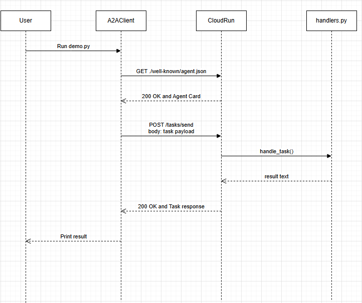

SETUP:
uvicorn server.main:app --reload
python client/demo.py

Part 4: Deploy EchoAgent to Cloud Run
bash cloud/deploy_cloud_run.sh

Part 5: Deploy to Vertex AI Agent Engine
python cloud/deploy_agent_engine.py

Part 6: Connection Trace
python client/demo.py

Part 7: Bonus Multi-Agent Chain
bash cloud/deploy_reverse_cloud_run.sh
python client/coordinator.py

ECHO_AGENT_URL = "https://echo-a2a-agent-5s56tqxt7q-uc.a.run.app"
REVERSE_AGENT_URL = "https://reverse-a2a-agent-5s56tqxt7q-uc.a.run.app"

26. Why does the request use a client-generated id rather than a server-generated one?
What problem does this solve in distributed systems?

A client-generated id lets the client identify what the task is before sending it. This is useful in distributed systems because
requests may be retried or processed by different servers. If the client knows their task ID, they can match the response
to the original request and see if there are any duplicate submissions and retry.

27. The status.state can be 'working'. Under what circumstances would a server return this
state in a non-streaming call, and how should a client react?

A server might return a status of 'working' in a non-streaming call when the task has been accepted but
not finished processing yet. This could happen with long works like web searches, large summary tasks or analysis. The client
can treat the response as not yet completed and not treat it as the final result.

28. What is the purpose of the sessionId field? Give a concrete example of two related tasks
that should share a session.

The sessionId field groups related tasks into the same workflow context. It allows the server to understand that
separate requests belong to the same ongoing interaction rather than being unrelated tasks.
One task could be "Summarize this article"
Then the second task could be "Now turn that summary into bullet points for a presentation"
These two tasks should share the same sessionId because the second task relies on the first task for additional context on what
the summary is.

29. The parts array supports types text, file, and data. Describe a realistic multi-agent
workflow where all three part types appear in a single conversation.

An example where all three types might appear in a single conversation if they need to provide additional info that is not text
For example:
A user sends a message, "Review this receipt and tell me if it is reimbursable."
They then attach a pdf for the file part which is an image of the receipt.
Another system could then include the data part which could be a JSON containing things like employee ID, expense category, amount

So an agent will first read the file and get the details into a data format, then a policy agent can use the data to figure out if its reimbursable. Then a response agent can turn that information into a human-readable decision.

37. In report.md Section 4, describe: (a) what the --allow-unauthenticated flag does and its
security implications, (b) how Cloud Run scales to zero and what cold start latency
means for A2A clients.

a) --allow-unauthenticated makes the Cloud Run service publicly invokable over HTTPS, so callers do not need Google-authenticated credentials to send requests. This means that anyone who knows the service URL can call the endpoint, so it should avoid exposing sensitive operations or private data unless there are other protections in place.

b) Cloud Run automatically scales the number of instances based on traffic, so when a revision receives no traffic it scales down to zero instances unless a different minimum instances is put. It is cost efficient to scale to zero, but the next incoming request might need to wait for a new container instance to start, which adds the startup delay known as cold start latency. This means the first request after an idle period can be noticeably slower than later requests, so clients should take this into account when deciding timeouts and retries.

42. In report.md Section 5, explain: (a) the difference between deploying to Cloud Run vs
Agent Engine in terms of operational burden and use-case fit, (b) why the wrapper class
uses a synchronous query() method even though the underlying handler is async.

a) Cloud Run is a general-purpose serverless platform where you can deploy a containerized API. Agent Engine is made for AI agents where you define a class with methods like query() and the platform handles request routing, lifecycle management, and integration with AI tooling. This reduces operational overhead and makes it better suited for LLM workflows.

b) The query() method in the wrapper is synchronous because AgentEngine expects a standard synchronous interface. Since the underlying handler is asynchornous, we can reuse the same logic by using asyncio.run() to execute the async function inside a synchronous method. This makes it work for the synchronous API expected by Agent Engine.

44. 
[request] GET https://agent2agent-1081000059174.us-central1.run.app/.well-known/agent.json
[response] 200 GET https://agent2agent-1081000059174.us-central1.run.app/.well-known/agent.json
[body] {"id":"echo-agent-v1","name":"Echo Agent","version":"1.0.0","description":"A simple agent that echoes back any text it receives.","url":"http://localhost:8000","contact":{"email":"support@example.c...
Agent name: Echo Agent
Skills:
- Echo (echo)
- Summarize (summarize)
[request] POST https://agent2agent-1081000059174.us-central1.run.app/tasks/send
[payload] {"id":"edec6e8a-a220-4e8c-8ed9-5842ceb19a61","sessionId":null,"message":{"role":"user","parts":[{"type":"text","text":"Hello from the client!"}]}}
[response] 200 POST https://agent2agent-1081000059174.us-central1.run.app/tasks/send
[body] {"id":"edec6e8a-a220-4e8c-8ed9-5842ceb19a61","status":{"state":"completed","message":null},"artifacts":[{"parts":[{"type":"text","text":"Hello from the client!"}]}]}
Response: Hello from the client!

45.

46. The client can retry by sending the same task request with the same client-generated id instead of making a new one. If the server sees the same id that it has already processed then it can return the existing result instead of doing the work again.
The A2A field that helps with idempotency is the task id, because the server can use it to detect duplicate submissions

51.
a) I would add authentication between agents by having each agent run with its own Google Cloud service account and use an identity token when calling another agent. The calling agent can get a service account token for the target and include it in the HTTP header on requests. This allows the receiving agent to only accept authorized access and only trusted agents with the right permissions could call each other

b) To pass a sessionId across the chain, the coordinator should keep track of the same sessionId when it sends requests to both agents. The coordinator needs to copy the sessionId into the downstream request, and lets the model know that the tasks are related to each other.